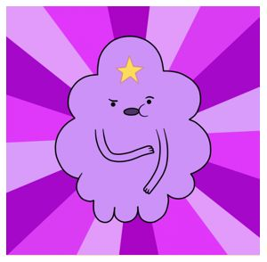

<!DOCTYPE html>
<html>
	<head>
		<title>Тест</title>
		
	</head>
	<body style="background-image: url(watercolor-textures-10.jpg)">
			

			

			
			
<h1>Рахманинова Елизавета</h1>

			
			

			<h2>
			 
				Дата рождения: <i>14 сентября 2001 г.</i> 
				Адрес:<i> г. Челябинск</i> 
				Телефон: <i>+7 (912) 477-54-78</i> 
				Эл. почта:<i> rozmaryblack@gmail.com</i> 
				Опыт работы:<i> без опыта</i> 
				Специальность:<i> разработчик веб</i> 
				<i>и мультимедийных приложений</i>
			</h2> 

			</img>
			<table border="1" rules="all" bgcolor="#fff" height="40px" width="30px">
			<caption style="font-size"30px"> <b>Знания программ и языков разметки<b></caption>
				<tr>
					<th></th>
					<th>Очень хорошие</th>
					<th>Хорошие</th>
					<th>Средние</th>
					<th>Ниже среднего</th>
					<th>Плохие</th>
				<tr><td>HTML</td><td></td><td></td><td>+</td><td></td><td></td></tr>
				<tr><td>CSS</td><td></td><td></td><td>+</td><td></td><td></td></tr>
				<tr><td>Adobe Photoshop CS6</td><td>+</td><td></td><td></td><td></td><td></td></tr>
				<tr><td>Corel Draw</td><td></td><td></td><td>+</td><td></td><td></td></tr>
				<tr><td>Blender</td><td></td><td>+</td><td></td><td></td><td></td></tr>
				</table>
				 <form name="test" method="post" action="input1.php">
					

<b>Телефон:</b> 
					<input type="tel" size="40" value="8-800-555-35-35">
					

					

<b>Ваше имя:</b> 
					<input type="text" size="40" value="Александр Сергеевич">
					

			</form>
				

			</body>
</html>
